Prerequisites for Linux
=======================

.. note::
   Install your favorite Python IDE. We prefer and use PyCharm. The further steps will be shown using PyCharm CE (Community Edition).

1. Install PyCharm
------------------

Install `Pycharm <https://www.jetbrains.com/pycharm/download/#section=linux>`_ Community or Professional Edition.
You can do it by clicking on the Download button.

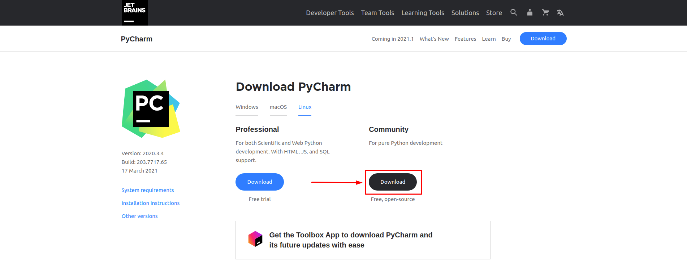

1. Unpack the PyCharm distribution archive that you downloaded
   where you wish to install the program. We will refer to this
   location as your {installation home}.

2. To start the application, open a console, cd into "{installation home}/bin" and type:

.. code-block:: bash

    ./pycharm.sh

You can also install Pycharm with command prompt:

For **Pycharm Community Edition**:

.. code-block:: bash

    sudo snap install pycharm-community --classic

For **Pycharm Professional Edition**:

.. code-block:: bash

    sudo snap install pycharm-professional --classic

2. Configure PyCharm
--------------------

Open Pycharm and install those Plugins:

     * .env files support
     * EnvFile
     * Requirements

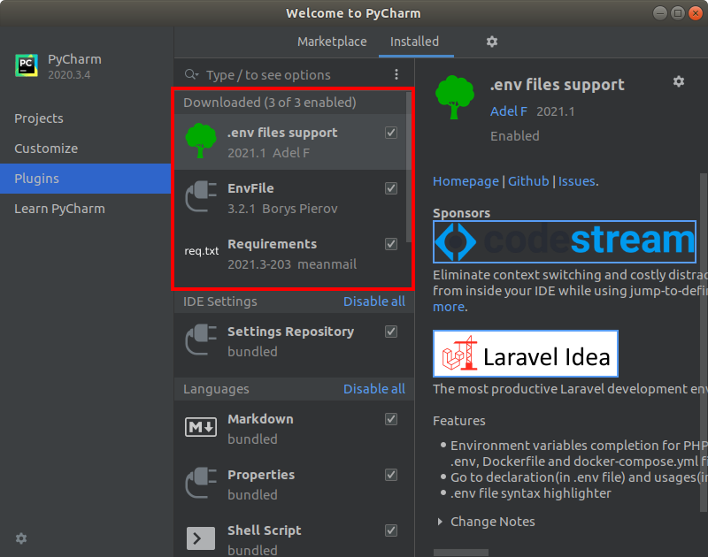

3. Prepare Working Directory
----------------------------

1. Download our Application `template <https://github.com/supervisely-ecosystem/app-template-headless/archive/refs/heads/master.zip>`_
from `GitHub <https://github.com/supervisely-ecosystem/app-template-headless>`_.
Unpack it to your working directory (e.g: /home/admin/work/app-dev).

2. Open downloaded project in PyCharm

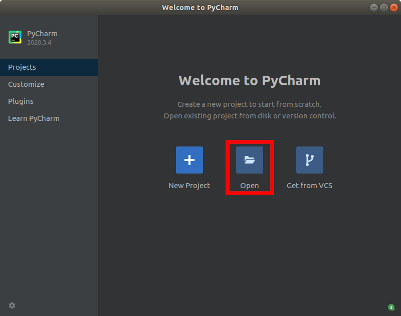

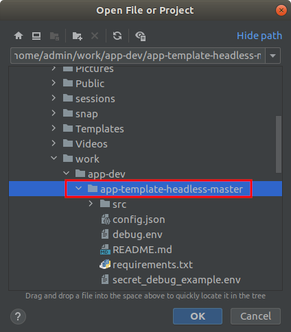

4. Configure PyCharm
--------------------

1. Add Pycharm Python Interpreter: File -> Settings -> Project -> Python Interpreter -> Press on Gear icon -> Add.

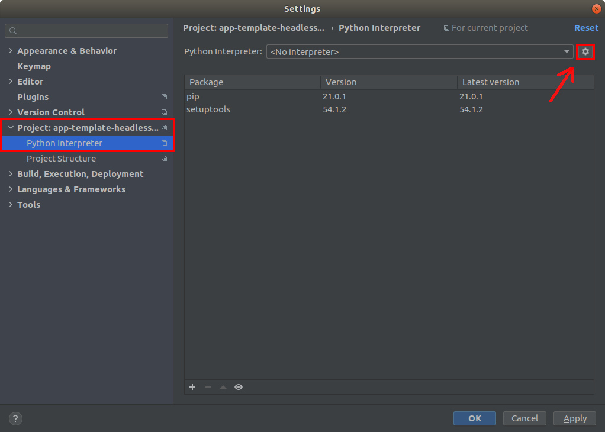

2. Configure Python Interpreter.

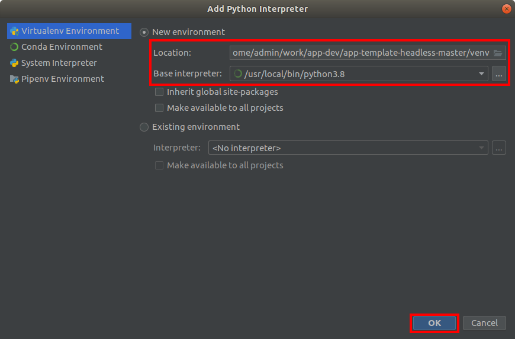

3. Select Python Interpreter

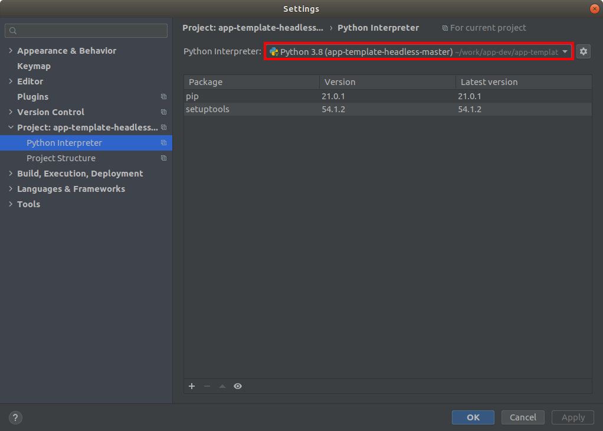

4. Directory **venv** should appear in your project now.

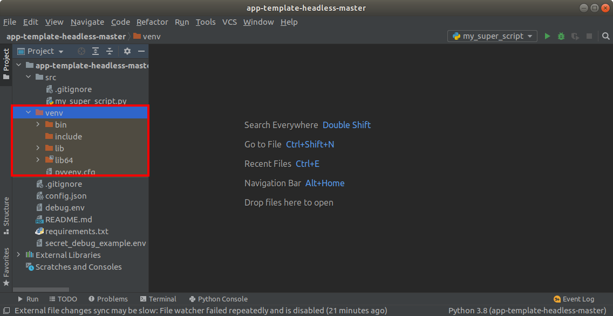

4. Configure PyCharm
--------------------

1. Open **requirements.txt** right click in IDE and select **Install All Packages**.

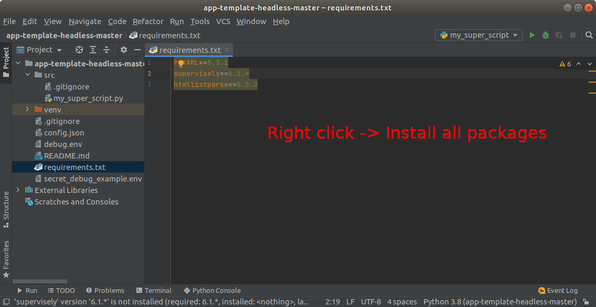

2. Press ``Add configuration`` -> **Edit configurations** in top right corner.

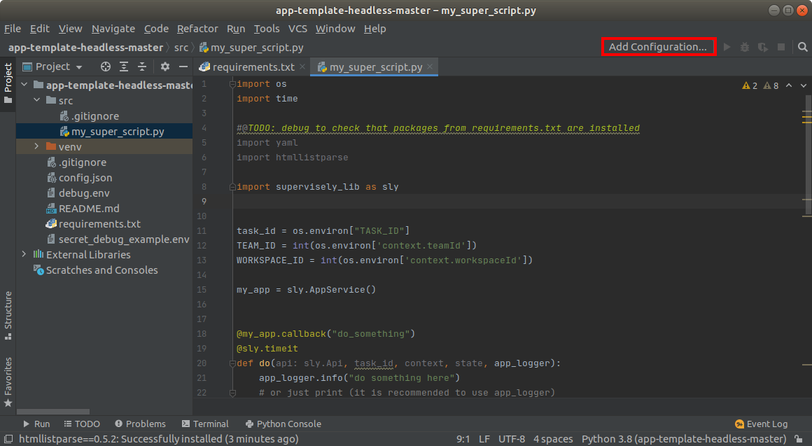

3. Add **+** Python and setup new configuration. And add **.env** files to it.
**secret_debug.env** contains your personal Supervisely credentials and must overwrite **debug.env**.

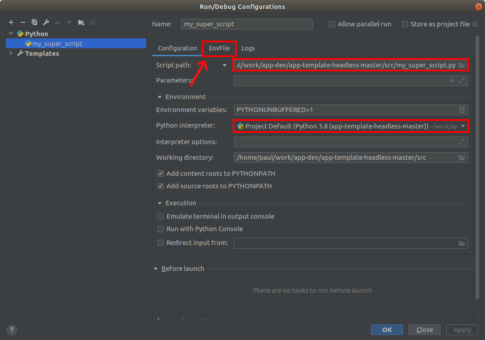

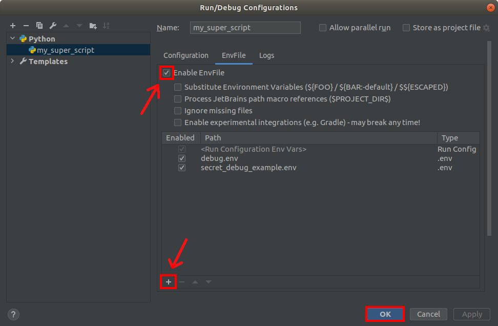

5. Final Steps
--------------

1. Last steps are all about setting up environment files.
Add following lines to your **debug.env**:

.. code-block:: python

   DEBUG_APP_DIR="/path/to/app_debug_data"
   DEBUG_CACHE_DIR="/path/to/app_debug_cache"
   LOG_LEVEL="debug"

2. Go to **Supervisely** -> **Ecosystem** and add **While True Script** Application.

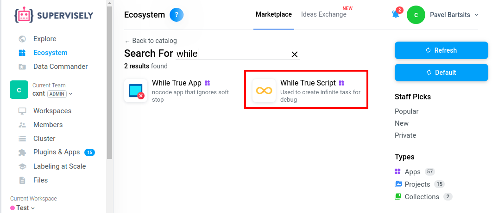

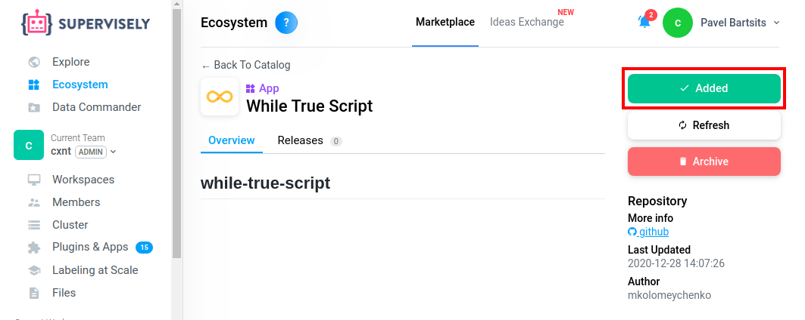

3. Run **While True Script** Application get it's ID and insert it to **debug.env** file.

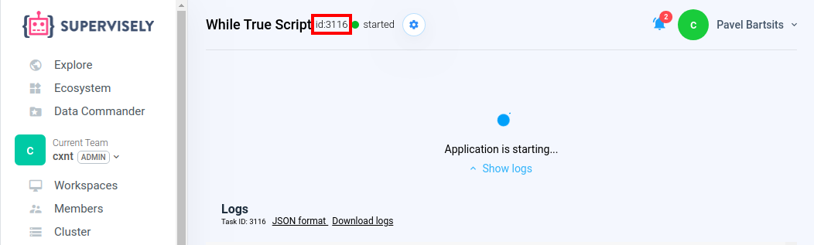

4. This is how your **debug.env** should look like after all manipulations.

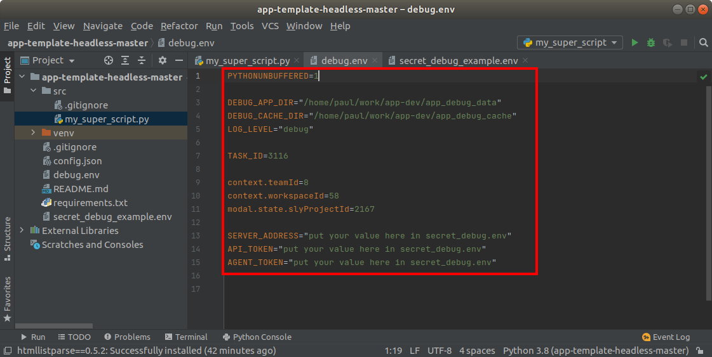

Configure **secret_debug.env**
------------------------------
Add Server Address variable:

.. code-block:: python

    SERVER_ADDRESS="https://app.supervise.ly/"

6. Get your Supervisely API Token and paste it to **API_TOKEN** variable.

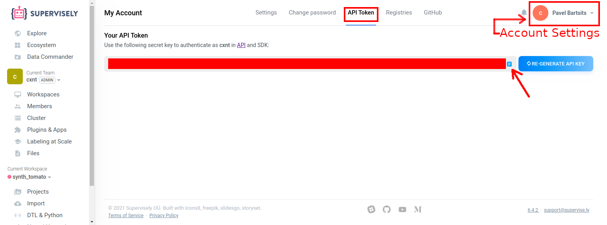

.. code-block:: python

    API_TOKEN="Insert your API Token here"

7. Get your Supervisely Agent Token and paste it to **AGENT_TOKEN** variable.

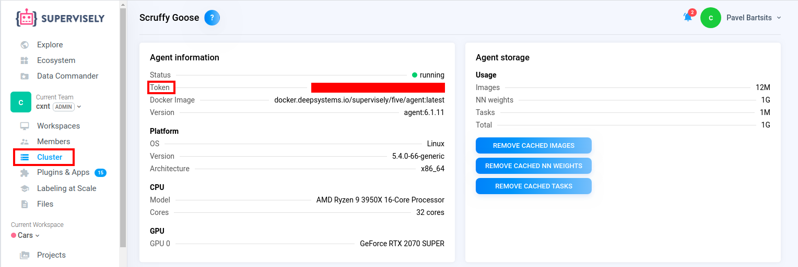

.. code-block:: python

    AGENT_TOKEN="Insert your Agent Token here"

.. warning::
   **Double check that secret_debug.env is added to .gitignore!**

All Done!
---------
