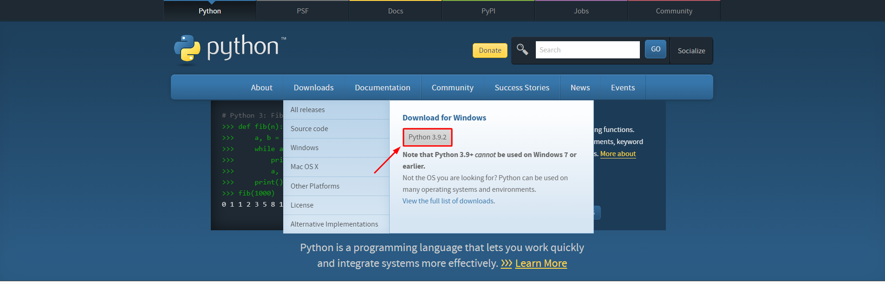
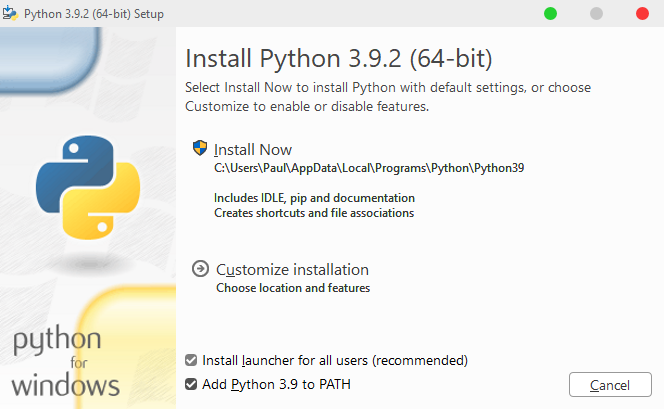
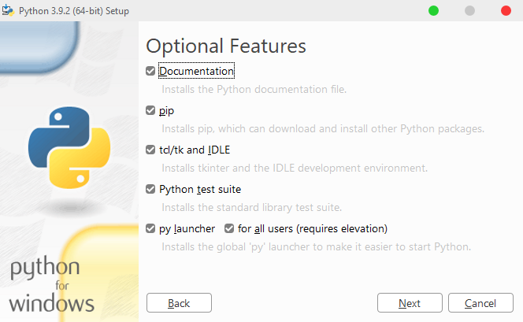
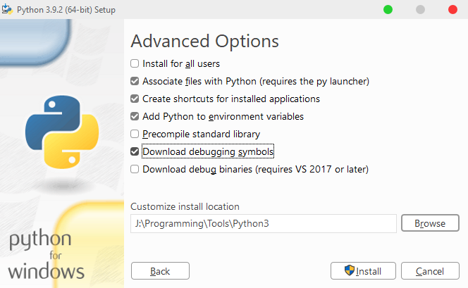
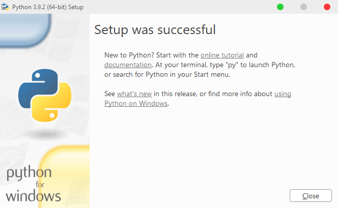

Prerequisites for Windows
=========================

.. note::
   If you already have Python >= 3.8 installed you can skip this step and go to Installation section.
   Recommended version: Python 3.8

1. Install Python
-----------------

1. Download Python from `official site <https://www.python.org/downloads/>`_.

2. Install Python.

You can install it with recommended or use custom settings. We'll use custom.

**Follow installation:**

